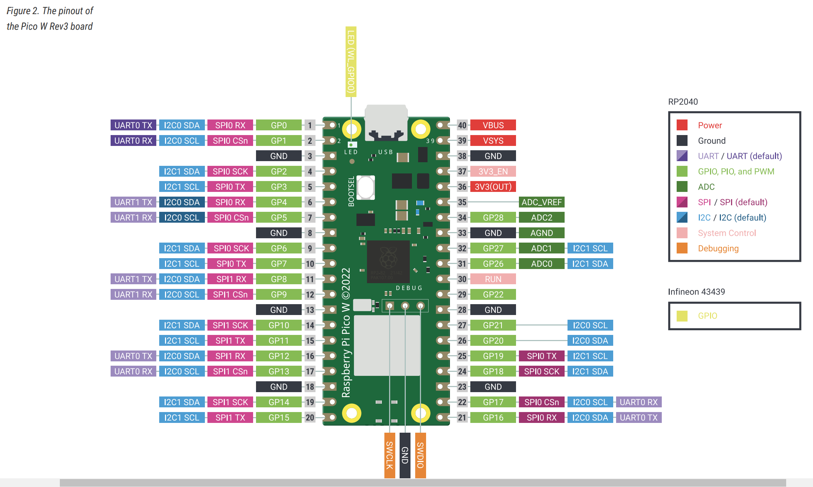

# Pico server code.

This repository holds a program and a bootloader for a raspberry pi pico w.

The code is a spinoff of the tutorial in this link.
https://projects.raspberrypi.org/en/projects/get-started-pico-w/1